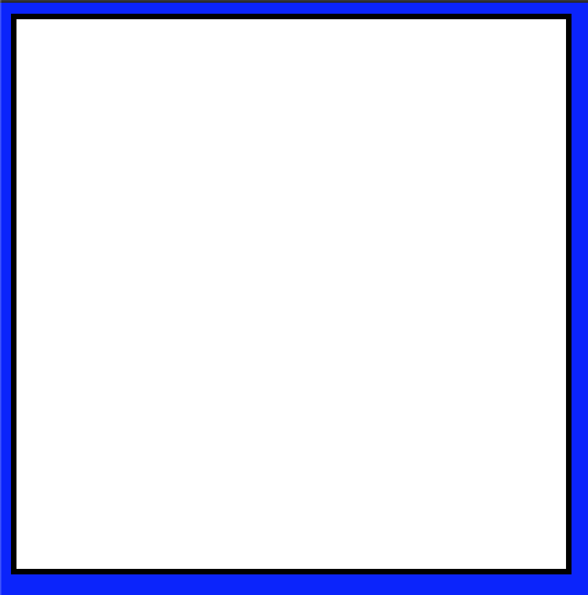
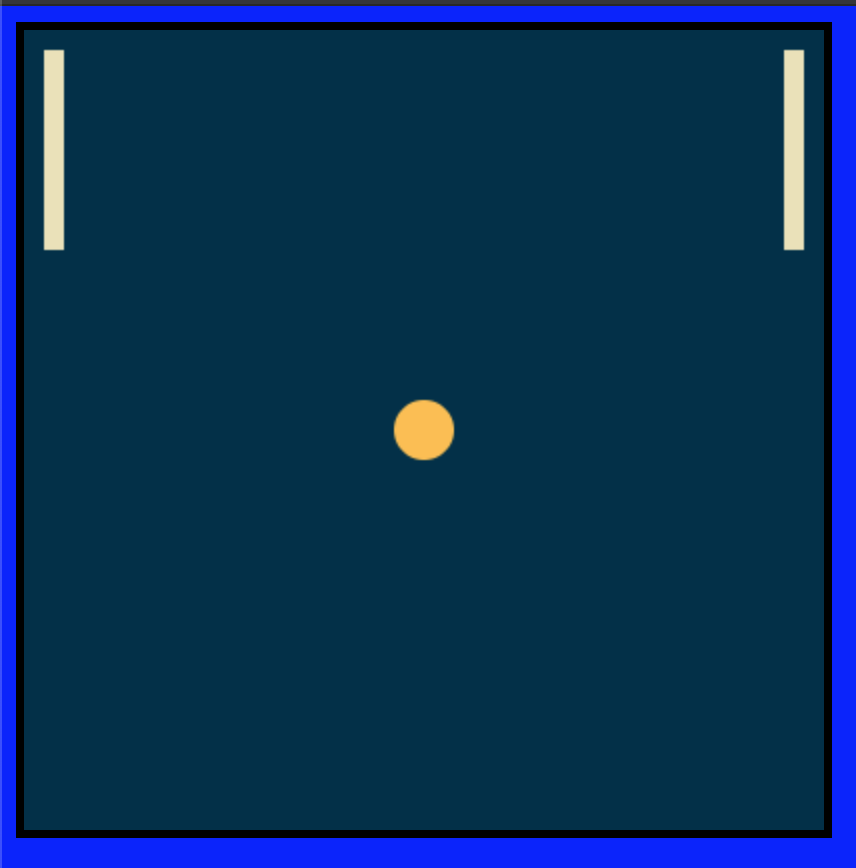

# Tutorial

In this tutorial, we are going to build a straightforward clone of the game 'PONG' using Minotaur.

You can play the final product [HERE](https://codyloyd.github.io/minotaur-pong/)
### A basic outline of what we're going to cover.

1. Project setup.
2. Drawing shapes with the Canvas API.
3. Animating those shapes.
4. Accepting user input.
5. Object collision.
6. Game states.

## Project setup

Minotaur was built to be used alongside modern JavaScript build-tools. You can get as far into setting up your environment as you want, but for this tutorial, we're going to keep things pretty basic.

We'll be using webpack to build our project and "http-server" to serve it so we can view it in the browser. If you know what you're doing, feel free to use any other combination of bundler and server.

### Installations

Create a folder for the project, and inside it run the following command to install the dependencies we'll need to build our game.
```
npm install @codyloyd/minotaur-base

npm install --save-dev webpack webpack-cli

npm install -g simple-http-server
```

Run the following commands to create the files we'll be using.
```
touch index.html

mkdir src
touch src/index.js
```

Add the following basic boilerplate to your `index.html`:
```html
<!-- index.html -->
<!DOCTYPE html>
<html lang="en">
<head>
  <title>TinyGame!</title>
</head>
<body>
  <style>
    body {
      background: blue;
    }
    canvas {
      border: 4px solid black ;
      background: white;
    }
  </style>
  <div id="game"></div>
  <script src="dist/main.js"></script>
</body>
</html>
```

Feel free to set up your HTML and CSS however you like. The critical item here is the `<div id="game">` which TinyGame uses to set up the game canvas.

In `src/index.js`, add the following code to import and initialize a new `Game` object.

```javascript
// src/index.js
import {Game} from '@codyloyd/minotaur-base'

const game = new Game({
  width: 400,
  height: 400,
  parent: 'game'
})

game.update = function(dt) {
}

game.draw = function() {
}

game.start()
```

At this point, if you build the code with webpack, you should be able to run it in your browser, and see a blank canvas! Run the following in the project folder:
```
npx webpack --mode=development --watch
```
in another terminal run
```
http-server
```

Watch the output as the server command runs and look for a URL. The default at the time of this writing is `http://localhost:8080`, but depending on the specifics of your system, it might be slightly different. Whatever the URL is, open it in your browser. You should see this:



## Drawing shapes

To draw shapes to our canvas, we are going to reference the native HTML Canvas API.
- [Here is an introduction](https://developer.mozilla.org/en-US/docs/Web/API/Canvas_API/Tutorial/Basic_usage) to Canvas if you've never seen it
- [This page](https://developer.mozilla.org/en-US/docs/Web/API/CanvasRenderingContext2D) is probably the most useful documentation page.

You don't need to know everything about Canvas to get started here. The general overview provided by the links above should be good enough for now.

Instead of re-implementing all of these canvas drawing functions, Minotaur exposes the rendering context of the game canvas that `new Game()` creates. Therefore, to draw shapes, all you need to do is reference that context and use the built-in methods!

In your `src/index.js` file, add a `fillRect` function to your game.draw() function like this:

```javascript
game.draw() {
  game.context.fillRect(20,20,100,100)
}
```

When you refresh your browser, you should now see a 100px wide black square in the upper corner of your Canvas! 

Most Canvas drawing functions, and therefore most Minotaur functions, take a similar set of arguments. In this case, the arguments are, in order: 

1. `x`: the x coordinates of the top-left corner of our shape
2. `y`: the y coordinates of the top-left corner of our shape
3. `width`: the width of our shape
4. `height`: the height of our shape

Which means, we've drawn a rectangle that starts at `x:20, y:20` and is `100px/100px`.

### Game Objects

For our PONG clone, we're going to need three shapes:
- Two rectangle paddles 
- a ball. 

To keep our code organized and to make moving these shapes around easier later, we're going to store them in JavaScript objects.

Add these objects to your `src/index.js` and then draw them inside your `game.draw()` function:

```javascript
const ball = {
  x: 200,
  y: 200,
  radius: 15
}

const leftPaddle = {
  x: 10,
  y: 10,
  w: 10,
  h: 100
}

const rightPaddle = {
  x: game.width - 20,
  y: 10,
  w: 10,
  h: 100
}

game.draw = function() {
  game.context.fillRect(leftPaddle.x, leftPaddle.y, leftPaddle.w, leftPaddle.h)
  game.context.fillRect(rightPaddle.x, rightPaddle.y, rightPaddle.w, rightPaddle.h)

  // this is the code for drawing a circle for our ball.
  game.context.beginPath()
  game.context.arc(ball.x, ball.y, ball.radius, 0, Math.PI * 2)
  game.context.fill()
}
```

The code for drawing a circle is a little tedious, so if it's something that you're going to be doing a lot you may want to abstract it out to it's own function like so:
```javascript
function drawCircle(x,y,radius) {
  game.context.beginPath()
  game.context.arc(ball.x, ball.y, ball.radius, 0, Math.PI * 2)
  game.context.fill()
}
```

Since we only need to draw one ball, we don't need to worry about this for now.

### Color

Drawing in color with Canvas is easy. Before doing a drawing operation, set a `fillStyle` using a css-color string. For something as simple as PONG, we don't need much color, but just to keep things interesting, let's pick a couple of colors for our paddles and ball. You can use any color that would be recognized in a css file such as an `rgb` or `hsl` color. Even [named colors](https://developer.mozilla.org/en-US/docs/Web/CSS/color_value#Color_keywords) are recognized.

Let's use a couple of hex colors for now.

```javascript
game.draw = function() {
  // this fillRect covers the entire screen and is the 'background' for our game
  game.context.fillStyle = "#003049"
  game.context.fillRect(0,0,game.width, game.height)
  game.context.fillStyle = "#eae2b7"
  game.context.fillRect(leftPaddle.x, leftPaddle.y, leftPaddle.w, leftPaddle.h)
  game.context.fillRect(rightPaddle.x, rightPaddle.y, rightPaddle.w, rightPaddle.h)

  // this is the code for drawing a circle for our ball.
  game.context.fillStyle = "#fcbf49"
  game.context.beginPath()
  game.context.arc(ball.x, ball.y, ball.radius, 0, Math.PI * 2)
  game.context.fill()
}
```

At this point, your code should [look like _this_](https://gist.github.com/codyloyd/0dae073b76753afe578cbd618c875fd7)

And running the game gives us this:



## Animation
To set things into motion, update each game object's position variables inside of the `game.update()` function.

To begin with, moving the ball across the screen is as simple as doing something like this:
```javascript
game.update(dt) {
  ball.x += 1
}
```
The above code runs every frame and increments the `x` position of the ball by 1px. However, the following issues arise:
- The movement speed is dependent on the game's framerate.
- The speed of the ball is constant and cannot be changed.

Updating our ball object and the `game.update()` function fixes both of these issues.

First, add variables to your ball object for x and y velocity. Call them `vx` and `vy` and then use those variables to control the speed of the ball:

```javascript
const ball = {
  x: 200,
  y: 200,
  vx: 50,
  vy: 60,
  radius: 15
}

game.update = function(dt) {
  // update ball position
  ball.x += ball.vx * dt
  ball.y += ball.vy * dt
}
```
Notice that in the above snippet, we multiply the velocity by `game.update`'s `dt` parameter. This parameter stands for the amount of time that has elapsed since the last time `game.update` has been called. Doing this calculation keeps the speed of the ball consistent, even if the framerate lags and the time between each iteration of the update function are inconsistent.

### Wall Bounce

Making the ball bounce off of the walls requires checking the position of the ball and changing its direction once it hits the edge of the game canvas. We can do this check inside of the update function like so:

``` javascript
game.update = function(dt) {
  // update ball position
  ball.x += ball.vx * dt
  ball.y += ball.vy * dt
  
  if (ball.x > game.width - ball.radius || ball.x < ball.radius) {
    ball.vx *= -1
  }
  if (ball.y > game.width - ball.radius || ball.y < ball.radius) {
    ball.vy *= -1
  }
}
```
With circles, the `x` and `y` coordinates refer to the center of the circle, and the `radius` is the distance from the center to the edge. Therefore when we do the calculation we have to take ball.radius into account.

On our game canvas, the ball is considered out of bounds if `ball.x` is bigger than `game.width - ball.radius` or if it is smaller than `ball.radius`.

If you run the game now, the ball should move and bounce around the screen. Feel free to update the velocity variables inside the ball object to fine-tune the speed.

## User input
Minotaur does not need to handle input for you, because JavaScript and the native DOM API are already perfectly capable of that. Handling user input is as easy as setting up event listeners.

In your `index.js` file, add a function to handle keypresses and then add a 'keydown' event listener that uses it. 

```js
function handleKeydown(event) {
  const key = event.key
  if (key == 'ArrowUp') {
    // move paddle up
  }
  if (key == 'ArrowDown') {
    // move paddle down
  }
}
document.addEventListener('keydown', handleKeydown)
```

Inside this function, we simply need to update our paddle position using the objects we've already set up. For now, we're going to keep the two paddles in sync, but you might want to either add a different set of keys for a second player or implement a little AI so you can play against the computer.

Our updated `handleKeydown` function:
```js
function handleKeydown(event) {
  const key = event.key
  if (key == 'ArrowUp') {
    leftPaddle.y -= 10
    rightPaddle.y -= 10
  }
  if (key == 'ArrowDown') {
    leftPaddle.y += 10
    rightPaddle.y += 10
  }
}
```

The above code is functional but introduces two easily fixed problems. 
- The paddles do not move smoothly when you press and hold a key down and depending on your computer's key-repeat settings, you might have to smash the arrow keys repeatedly to get the paddle to move more than 10px at a time.
- The paddles can move off the screen!

There are a few steps required to fix the first issue:
1. Add a property for the paddle's velocity (`vy`) to each paddle. (We don't need a `vx` because the paddles can only move up and down.)
2. Use that property to update the position of the paddle.
3. Change the paddle's velocity when a key is pressed and reset the velocity when that key is released.

### Smooth Paddle Motion

#### Add velocity property to paddles:
```js
const leftPaddle = {
  x: 10,
  y: 10,
  w: 10,
  h: 100,
  // ADD THIS!
  vy: 0
}

const rightPaddle = {
  x: game.width - 20,
  y: 10,
  w: 10,
  h: 100,
  // ADD THIS!
  vy: 0
}
```

#### Update position of paddles in game.update

```js
game.update = function(dt) {
  // update ball position
  ball.x += ball.vx * dt
  ball.y += ball.vy * dt

  //ADD THIS!
  // update paddle position
  leftPaddle.y += leftPaddle.vy * dt
  rightPaddle.y += rightPaddle.vy * dt

  ...
}
```

#### Use keypresses to change paddle velocity.
Since we want to change the velocity only when a key is pressed down, we need to do a little refactoring to our handleKeydown function and add a new function for handling keyUp. There are many possible ways to solve this problem. We're going to add an object for keeping track of which keys are pressed down at any given time and then manipulate that object in our keypress-handlers.

```js
const isDown = {
  ArrowUp: false,
  ArrowDown: false
}
function handleKeydown(event) {
  const key = event.key
  if (key == 'ArrowUp') {
    isDown.ArrowUp = true
  }
  if (key == 'ArrowDown') {
    isDown.ArrowDown = true
  }
}
function handleKeyup(event) {
  const key = event.key
  if (key == 'ArrowUp') {
    isDown.ArrowUp = false
  }
  if (key == 'ArrowDown') {
    isDown.ArrowDown = false
  }
}
document.addEventListener('keydown', handleKeydown)
document.addEventListener('keyup', handleKeyup)
```

Then, we can use the `isDown` object to update our paddle velocity inside the `game.update` function. To make sure the velocity is always reset to `0` when keys are released, we're going to _always_ set it to `0`, and then check for `isDown` on our keys to override that.

```js
game.update = function(dt) {
  // update ball position
  ball.x += ball.vx * dt
  ball.y += ball.vy * dt

  // update paddle velocity
  leftPaddle.vy = 0
  rightPaddle.vy = 0
  if (isDown.ArrowDown) {
    leftPaddle.vy = 180
    rightPaddle.vy = 180
  }
  if (isDown.ArrowUp) {
    leftPaddle.vy = -180
    rightPaddle.vy = -180
  }

  // update paddle position
  leftPaddle.y += leftPaddle.vy * dt
  rightPaddle.y += rightPaddle.vy * dt
```

### Keep the paddles on the screen
Keeping the paddles from going off the edge of the screen can be handled in basically the same way as our ball collision. We're just going to set the velocity of the paddles to `0` when they hit the border. We're also going to reset the paddle's position to the actual limit so that the paddle doesn't get 'stuck' in the wall.
This adds quite a bit of code, so here is the entire `game.update` function
```js
game.update = function(dt) {
  // update ball position
  ball.x += ball.vx * dt
  ball.y += ball.vy * dt

  if (ball.x > game.width - ball.radius || ball.x < ball.radius) {
    ball.vx *= -1
  }
  if (ball.y > game.width - ball.radius || ball.y < ball.radius) {
    ball.vy *= -1
  }

  // update paddle velocity
  leftPaddle.vy = 0
  rightPaddle.vy = 0
  if (isDown.ArrowDown) {
    leftPaddle.vy = 180
    rightPaddle.vy = 180
  }
  if (isDown.ArrowUp) {
    leftPaddle.vy = -180
    rightPaddle.vy = -180
  }

  if (leftPaddle.y < 0) {
    leftPaddle.vy = 0
    leftPaddle.y = 0
  }
  if(leftPaddle.y > game.height - leftPaddle.h) {
    leftPaddle.vy = 0
    leftPaddle.y = game.height - leftPaddle.h 
  }

  if (rightPaddle.y < 0) {
    rightPaddle.vy = 0
    rightPaddle.y = 0
  }
  if(rightPaddle.y > game.height - rightPaddle.h) {
    rightPaddle.vy = 0
    rightPaddle.y = game.height - rightPaddle.h 
  }

  // update paddle position
  leftPaddle.y += leftPaddle.vy * dt
  rightPaddle.y += rightPaddle.vy * dt
}
```

## Some refactoring
You may have noticed that our last few updates have added quite a bit of repeated code since we have to do the same position and velocity checks for each paddle every time. Almost any other game is going to end up being much more complicated than this one, so it's a problem that's worth solving. To clean it up, we're going to abstract out our paddle code into a simple class and put all of the update code into _that_ file. Doing so will clean up our update function considerably.

Since we're using webpack we can move the paddle logic to a new file easily. Add a new file to your project directory called `paddle.js` and then import it at the top of your `index.js` like so:

```js
// src/index.js
import {Paddle} from './paddle'
```

Create a new `Paddle` class inside the new file and export it. This snippet is empty but has all the functions we're going to implement.
```js
// src/paddle.js
class Paddle {
  constructor(x, y, w, h) {

  }
  update(dt) {

  }
  draw(context) {

  }
}

export {Paddle}
```

#### The constructor function. 
If we fill out our constructor function, we can begin using the class to create our objects immeditately.
```js
// src/paddle.js
class Paddle {
  constructor(x, y, w, h) {
    this.x = x
    this.y = y
    this.w = w
    this.h = h
    this.vy = 0
  }
  ...
}
```
```js
// src/index.js
// remove the original leftPaddle and rightPaddle objects, 
// replace them with this:
const leftPaddle = new Paddle(10,10,10,100)
const rightPaddle = new Paddle(game.width-20,10,10,100
```

At this point, the game should still run as it did before, next lets move the update logic into our class. There are some global variables being accessed inside our game's update function, so to get them into the `Paddle.update` we are going to pass them in as arguments. The following code is essentially our original `leftPaddle` update code with `leftPaddle` renamed to `this`.
```js
// src/paddle.js
class Paddle {
  ...
  update(dt, isDown, height) {
    this.vy = 0
    if (isDown.ArrowDown) {
      this.vy = 180
    }
    if (isDown.ArrowUp) {
      this.vy = -180
    }

    if (this.y < 0) {
      this.vy = 0
      this.y = 0
    }
    if(this.y > height - this.h) {
      this.vy = 0
      this.y = height - this.h 
    }

    this.y += this.vy * dt
  }
}
```
We can now, remove all of the update code from our index update loop and replace it like so:
```js
// src/index.js
game.update = function(dt) {
  // update ball position
  ball.x += ball.vx * dt
  ball.y += ball.vy * dt

  if (ball.x > game.width - ball.radius || ball.x < ball.radius) {
    ball.vx *= -1
  }
  if (ball.y > game.width - ball.radius || ball.y < ball.radius) {
    ball.vy *= -1
  }

  // update paddles
  leftPaddle.update(dt, isDown, game.height)
  rightPaddle.update(dt, isDown, game.height)
}
```
Finally, follow the same process with the 'draw' logic. Notice we're passing in the `game.context` so our paddles know where to draw themselves.

```js
// src/paddle.js
class Paddle {
  draw(context) {
    context.fillStyle = "#eae2b7"
    context.fillRect(this.x, this.y, this.w, this.h)
  }
}
```

```js
// src/index.js
game.draw = function() {
  // this fillRect covers the entire screen and is the 'background' for our game
  game.context.fillStyle = "#003049"
  game.context.fillRect(0,0,game.width, game.height)

  // draw paddles
  leftPaddle.draw(game.context)
  rightPaddle.draw(game.context)

  // this is the code for drawing a circle for our ball.
  game.context.fillStyle = "#fcbf49"
  game.context.beginPath()
  game.context.arc(ball.x, ball.y, ball.radius, 0, Math.PI * 2)
  game.context.fill()
}
```
The complete current status of `index.js` and `paddle.js` can be found [in this gist](https://gist.github.com/codyloyd/f439bb80e6b9f1c3031f8535f8c934c3)

If you want, you could easily replicate this refactoring step with the ball, in a new file called `ball.js`. For now, since we only have one ball, we won't worry about doing that.

## Object collision
Lets get our ball bouncing off of those paddles! The algorithm for checking whether or not the ball is colliding with the paddles is below. Add it to your index.js. For more information about this very useful algorithm search "AABB collision detection".
```js
function isBallColliding(paddle) {
  if (ball.x - ball.radius < paddle.x + paddle.w &&
    ball.x + ball.radius > paddle.x &&
    ball.y - ball.radius < paddle.y + paddle.h &&
    ball.y + ball.radius > paddle.y) {
    return true
  }
}
```

All we have to do now is use the `isBallColliding` function in our game.update like so: 

```js
game.update = function(dt) {
  ...

  if (isBallColliding(leftPaddle) || isBallColliding(rightPaddle)) {
    ball.vx *= -1
  }
}
```

Now,  your ball should bounce off the paddles!

## Score and Game states
The game is pretty much complete now! All we need to do is add a running score, and create starting and ending screens. 

### Score
As usual, there are multiple viable ways of managing each of these things. We _could_ add the `score` variable to our Paddle class, or we could create a new `Player` class to manage things like that.  To keep things simple, we're just going to store a `score` object in our index.js.

```js
// src/index.js
const score = {
  player1: 0,
  player2: 0
}
```

Draw the score to the screen in the `game.draw` function. There's a little math involved in getting it lined up to the center of the screen.
```js
game.draw = function() {
  ...
  const scoreText = `${score.player1} | ${score.player2}`
  const textWidth = game.context.measureText(scoreText).width
  game.context.fillStyle = "#eae2b7"
  game.context.font = "48px"
  game.context.fillText(scoreText,(game.width/2)-(textWidth/2),50,game.width)
}
```

Now, in the `game.update` add the logic to increment the correct player's score when the ball hits one of the sides. We'll also reset the ball position to the middle of the screen and change it's direction when it hits. Currently, we're still doing the 'wall bounce' off of those walls, but now that we have working paddles, we can remove that and replace it with our scoring code. Here is the entire game.update function.
```js
game.update = function(dt) {
  // update ball position
  ball.x += ball.vx * dt
  ball.y += ball.vy * dt

  if (ball.y > game.width - ball.radius || ball.y < ball.radius) {
    ball.vy *= -1
  }

  // this is what we're adding!
  if (ball.x > game.width - ball.radius) {
    // increment score
    score.player2 += 1
    // reset position
    ball.x = 200
    ball.y = 200
    // change it's direction
    ball.vx *= -1
  }
  if (ball.x < ball.radius) {
    // increment score
    score.player1 += 1
    // reset position
    ball.x = 200
    ball.y = 200
    // change it's direction
    ball.vx *= -1
  }

  leftPaddle.update(dt, isDown, game.height)
  rightPaddle.update(dt, isDown, game.height)

  if (isBallColliding(leftPaddle) || isBallColliding(rightPaddle)) {
    ball.vx *= -1
  }
}
```

### Game states
Game state logic can get quite complicated, but for a game as simple as this one, it doesn't need to be too involved. We're going to:
1. Create a variable called `gameState`.
2. Use that variable to determine what we draw on the screen.
3. Update that variable in our code when appropriate to change the game state.

Add the following to index.js:
```js
let gameState = 'start'
```

In a more complicated game, we _could_ end up with many different states. For now, we're going to stick to 'start', 'play' and 'end'.

The Draw function for each of these screens can get quite long. In some cases, it might make more sense to move these screen draw functions into new modules. For the sake of clarity, we'll keep them in index.js. All we need to do is check the `gameState` variable inside of our draw function, draw our 'title' screen if the state is `play`, draw the 'game over' screen if it is `end` and draw the actual game screen if it is `play`.

Add the following to the top of your game.draw function.
```js
  if (gameState === 'start') {
    game.context.fillStyle = "#001029"
    game.context.fillRect(0,0,game.width, game.height)
    game.context.fillStyle = "#eae2b7"
    game.context.font = "48px serif"
    let textWidth = game.context.measureText('PONG').width
    game.context.fillText("PONG", game.width/2 - textWidth/2, 100)

    game.context.font = "28px serif"
    const subtitle = 'press any key'
    textWidth = game.context.measureText(subtitle).width
    game.context.fillText(subtitle, game.width/2 - textWidth/2, 300)

    // return is significant here. We don't want to draw anything else
    // if we're in the 'start' state
    return
  }

  if (gameState === 'end') {
    game.context.fillStyle = "#001029"
    game.context.fillRect(0,0,game.width, game.height)
    game.context.fillStyle = "#eae2b7"
    game.context.font = "48px serif"
    let textWidth = game.context.measureText('GAME OVER').width
    game.context.fillText("GAME OVER", game.width/2 - textWidth/2, 100)

    game.context.font = "28px serif"
    const subtitle = 'press any key'
    textWidth = game.context.measureText(subtitle).width
    game.context.fillText(subtitle, game.width/2 - textWidth/2, 300)

    // return is significant here. We don't want to draw anything else
    // if we're in the 'end' state
    return
  }
```

Notice we're doing that `measureText` calculation multiple times to center our text. It might be a good idea to move that out to a new function.

We also need to add a statement to the top of our update function to make sure the game isn't running in the background while we're not on the `play` screen.

```js
game.update = function(dt) {
  if(gameState === "start" || gameState === "end") {
    return
  }
  ...
}
```

Add the following code to the `handleKeydown` function, so that our "start" and "end" states transition when pressing any key:

```js
function handleKeydown(event) {
  const key = event.key
  // ADD THIS
  if (gameState === "start") {
    // reset the score for a new game!
    score.player1 = 0
    score.player2 = 0
    gameState = "play"
  }
  // AND THIS
  if (gameState === "end") {
    gameState = "start"
  }

  if (key == 'ArrowUp') {
    isDown.ArrowUp = true
  }
  if (key == 'ArrowDown') {
    isDown.ArrowDown = true
  }
}
```

_Finally_, add a check inside of `game.update` to end the game when one player gets 5 points

```js
game.update = funtion(dt) {
  if (score.player1 == 5 || score.player2 == 5) {
    gameState = "end"
  } 
}
```

## Conclusion

That's it!  The game is in a state that we could call 'complete'.  Of course, NO game is ever _actually_ finished, is it?

The code for our completed project can be found in [this repo](https://github.com/codyloyd/minotaur-pong).

You can play that example [HERE](https://codyloyd.github.io/minotaur-pong/).
### What next?
There are several improvements you could make to this game. Consider the following:
- Display the winner on the 'end' screen.
- Make it work for two players or one player vs. computer.
- Make the ball speed up as the game progresses.
- Add 'powerups' like extra balls, or an extra-long paddle.
- Add a 'paused' state.
- Use pretty images instead of basic shapes.